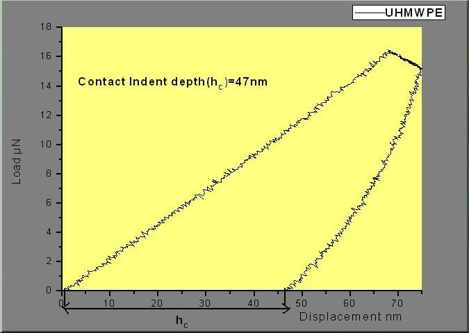

Nanoindentation is a standard method to investigate mechanical properties like hardness,elasticity,plasticity index of the material which gives ability to resist permanently,deformed when load is applied.It is mainly concerned with the depth of penetration to nm resolution and the measuring the forces in the uN range in high accuracy and precision. Hardness is proportional to the applied load P divided by the area of contact surface projected in the material. Elastic deformation occurs due to the stretching of the bonds between the atoms when load is applied and when load is removed,it comes back to the original shape.Plastic deformation occurs when load is applied beyond the elastic limit and permanent deformation will takes place. Tensile testing are normally used for bulk samples but nanoindentation can even measure thin film coatings, polymeric materials and soft tissues etc.  

 
<video width="500" height="240" controls>
  <source src="images/nfm.mp4" type="video/mp4">
  Your browser does not support the video tag</video>
 
  

<a href="https://youtu.be/-8HISU35vhY">NPTEL Link</a>  
<b>How to perform Nanoindentation?</b>  
Nanoindentation is a powerful technique where the indenter tip of known geometry is projected into the specific site in the material to be tested, increasing load is applied and when it reaches the designated maximum value, partial unloading is performed until desired depth is attained. The holding segment is introduced which allows the material to relax before unloading. The process is repeated many times and position of the indenter tip and the surface is monitored with differential transformer.  
<b>Indent depth</b> is the depth from the surface of the sample to the indenter tip or indentation depth of the indenter. The maximum depth is the total displacement of the material and the indenter at maximum load which includes the plastic and elastic deformation. Contact depth can be calculated by:-  
hc = h + hp (or) hc = h - hp  
Where' hc' is the contact depth of deformed surface and it is the function of young's modulus E, Poisson ratio, and yield strength Y, 'h' is the indentation depth of original surface and 'hp' is the pile up height if it is positive or sink in depth if it is negative. The ratio hc / h is greater than one in the case of surface pile ups and less than one in the case of surface sinks in. Material possessing high elasticity will undergo sink in whereas material possessing plastic zone will undergo pile up. To measure contact indentation depth, pile up and sink in should be taken into account.  
<b>Results</b>  
 
 
  
<b>Conclusion</b>  

